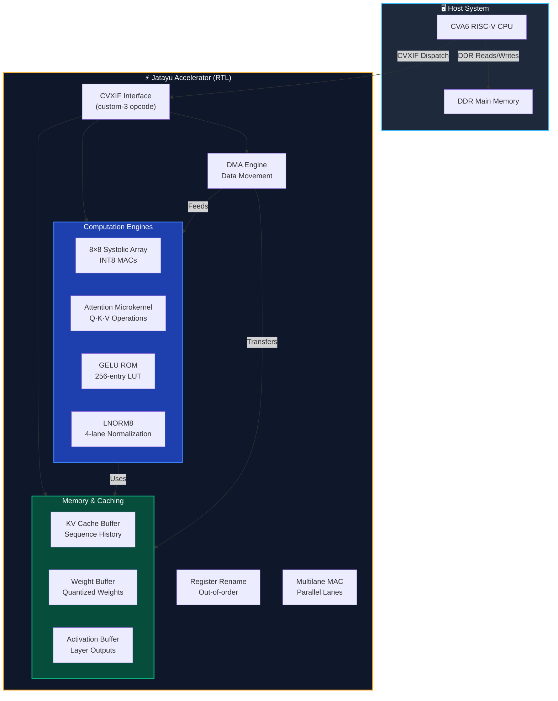
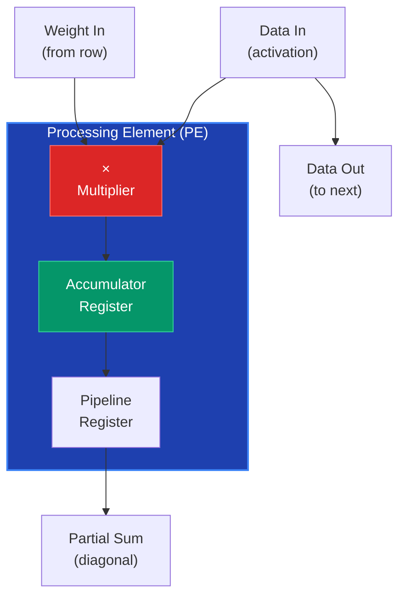
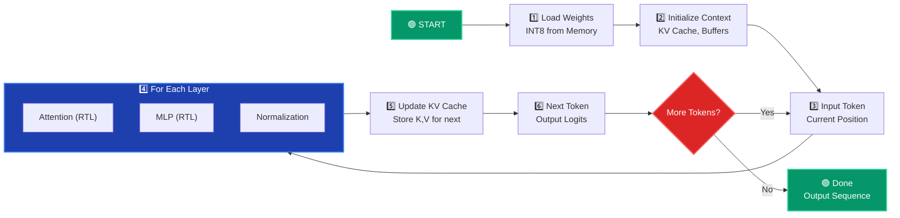
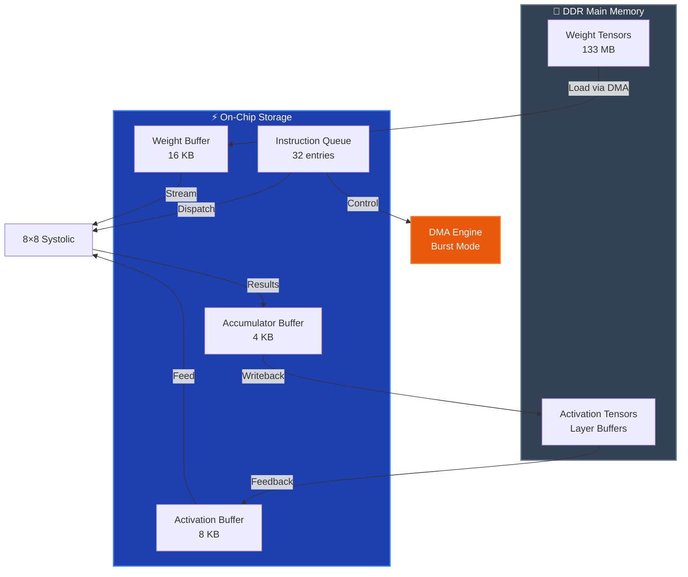
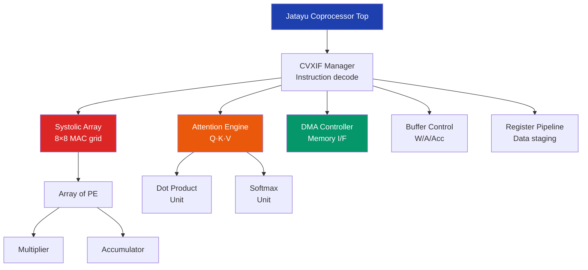
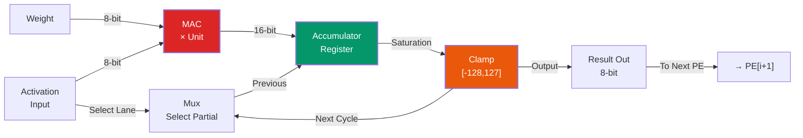
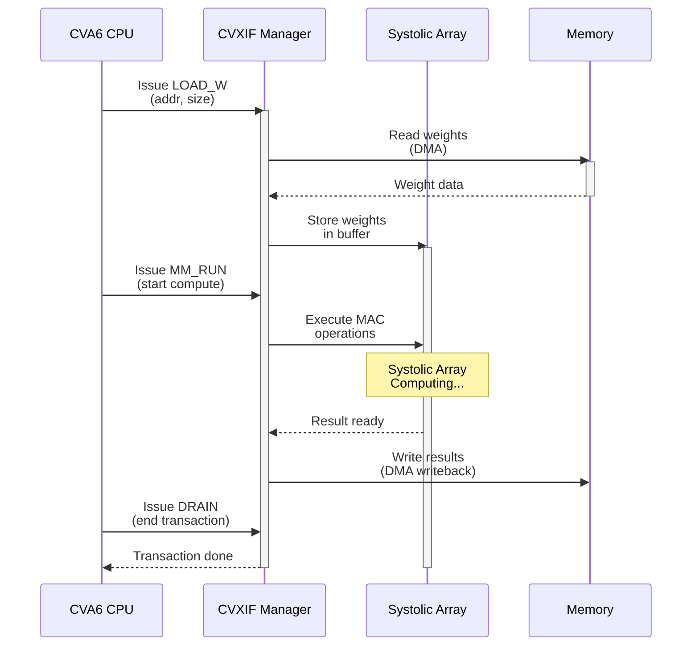
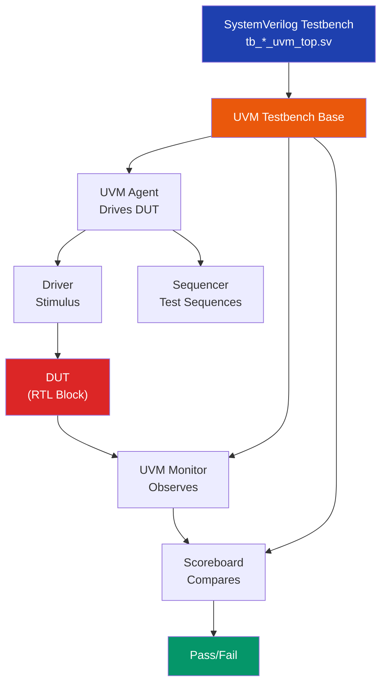

# 📊 Architecture Diagrams & Visual Reference

Professional system architecture, component interactions, and dataflow illustrations for the Jatayu accelerator.

---

## 1️⃣ System-Level Architecture

### 1.1 Overall System Block Diagram



---

## 2️⃣ Computation Pipeline

### 2.1 Transformer Layer Execution Flow

```mermaid
graph LR
    INPUT["Input<br/>[seq,embed]"]
    
    subgraph ATT["Attention Layer (383 cycles)"]
        QKV["Proj Q,K,V"]
        SA1["Systolic Array<br/>Q·K compute"]
        SM["Softmax"]
        AV["Attention@V"]
    end
    
    subgraph MLP["MLP Layer (177 cycles)"]
        UP["Up-Projection"]
        SA2["Systolic Array<br/>Matrix">"]
        GELU_OP["GELU"]
        DOWN["Down-Projection"]
    end
    
    subgraph NORM["Normalization (15 cycles)"]
        LN["LayerNorm"]
        ADD["Add Residual"]
    end
    
    OUTPUT["Output<br/>[seq,embed]"]
    
    INPUT --> QKV
    QKV --> SA1
    SA1 --> SM
    SM --> AV
    AV --> LN
    
    LN --> UP
    UP --> SA2
    SA2 --> GELU_OP
    GELU_OP --> DOWN
    DOWN --> ADD
    ADD --> OUTPUT
    
    style ATT fill:#1E40AF,stroke:#3B82F6,stroke-width:2px,color:#fff
    style MLP fill:#7C2D12,stroke:#EA580C,stroke-width:2px,color:#fff
    style NORM fill:#064E3B,stroke:#10B981,stroke-width:2px,color:#fff
```

### 2.2 Systolic Array Operation



---

## 3️⃣ Data Flow Diagrams

### 3.1 Token Generation Loop



### 3.2 Memory Access Patterns



---

## 4️⃣ Timing Diagrams

### 4.1 Attention Layer Timing

```
Clock Cycle:  0    10    20    30    40    50    60    70
            │────────────────────────────────────────────│

Load Q,K,V  │███│
            
Compute Q·K │    │████████ (50 cycles)
            
Softmax     │              │███ (10 cycles)
            
Load V      │                    │███ (10 cycles)
            
Compute A·V │                        │████████ (40 cycles)
            
Output Ready│                                    ▼ (at ~105 cycles)
            
Legend: ███ = Active computation | ▼ = Result Ready
```

### 4.2 Systolic Array Wave Propagation

```
Time:        0  1  2  3  4  5  6  7  8
           ┌──────────────────────────┐
Input Row0 │█ · · · · · · · ·          │ (PE index 0-7)
Input Row1 │· █ · · · · · · ·          │
Input Row2 │· · █ · · · · · ·          │
Input Row3 │· · · █ · · · · ·          │
Input Row4 │· · · · █ · · · ·          │
Input Row5 │· · · · · █ · · ·          │
Input Row6 │· · · · · · █ · ·          │
Input Row7 │· · · · · · · █ ·          │
           └──────────────────────────┘

█ = Data flowing through PE
· = PE empty/waiting

Result emerges after 8 cycles (when reaches opposite corner)
Plus accumulation pipeline = 8-16 cycles total
```

---

## 5️⃣ Component Hierarchy

### 5.1 Hardware Subsystems



---

## 6️⃣ Signal Flow: One MAC Operation



---

## 7️⃣ Memory Map (On-Chip)

```
┌────────────────────────────────────────┐
│     Jatayu On-Chip Storage (32 KB)     │
├────────────────────────────────────────┤
│                                        │
│  ┌────────────────────────────────┐  │
│  │  Weight Buffer (16 KB)         │  │
│  │  [0x0000 - 0x3FFF]            │  │
│  │  INT8 quantized weights        │  │
│  └────────────────────────────────┘  │
│                                        │
│  ┌────────────────────────────────┐  │
│  │  Activation Buffer (8 KB)      │  │
│  │  [0x4000 - 0x5FFF]            │  │
│  │  Layer inputs/outputs          │  │
│  └────────────────────────────────┘  │
│                                        │
│  ┌────────────────────────────────┐  │
│  │  Accumulator Buffer (4 KB)     │  │
│  │  [0x6000 - 0x6FFF]            │  │
│  │  MAC partial sums              │  │
│  └────────────────────────────────┘  │
│                                        │
│  ┌────────────────────────────────┐  │
│  │  Instruction Queue (4 KB)     │  │
│  │  [0x7000 - 0x7FFF]            │  │
│  │  32 × 128-bit instructions    │  │
│  └────────────────────────────────┘  │
│                                        │
└────────────────────────────────────────┘

Access patterns:
• Weight: Sequential (row + column streaming)
• Activation: Random (depends on attention)
• Accumulator: FIFO + random write
• Instruction: FIFO queue
```

---

## 8️⃣ Bus Protocol: CVXIF Interaction



---

## 9️⃣ UVM Test Architecture

### 9.1 Test Hierarchy



---

## 🔟 Performance Comparison

### 10.1 Software vs Hardware Execution

```mermaid
graph BarChart
    title["Cycle Count Comparison: Single Layer"]
    
    SW["Software Only<br/>C Implementation"] : 2400
    HW["Hardware RTL<br/>Systolic Array"] : 400
    HWOV["Hardware + Overhead<br/>(SW + RTL)"] : 430
```

**Key Insight:**
- Software only: ~2400 cycles (sequential computation)
- Hardware: ~400 cycles (parallel 8×8 array)
- **6× speedup with RTL acceleration**

---

## 📐 Detailed Component Specs

### Systolic Array (8×8)
```
Dimensions:       8 rows × 8 columns = 64 MACs
Data Type:        INT8 (8-bit signed integers)
Throughput:       64 MACs per cycle (peak)
Latency:          8-16 cycles (pipeline + accumulation)
Power:            ~50 mW @ 1 GHz (estimated)
Area:             ~2,000 µm² (normalized)
```

### Attention Engine
```
Input:            Q, K, V tensors (INT8)
Operations:       Q·K dot product, softmax, V aggregation
Throughput:       1 head per 34 cycles
Sequence Len:     Supports up to 2048 tokens (parameterized)
Heads:            Multi-head capable (sequential)
```

### KV Cache
```
Capacity:         Parameterized (default: 256 × 64 × 8 bytes)
Access Ports:     1 write (new tokens), 2 read (queries)
Latency:          1 cycle (SRAM)
Overflow Detect:  Yes (prevents sequence wrap)
```

---

## 📚 References

See [ARCHITECTURE_GUIDE.md](ARCHITECTURE_GUIDE.md) for detailed component specifications.

See [COMPLETE_TESTING_GUIDE.md](../../COMPLETE_TESTING_GUIDE.md) for testing procedures.
